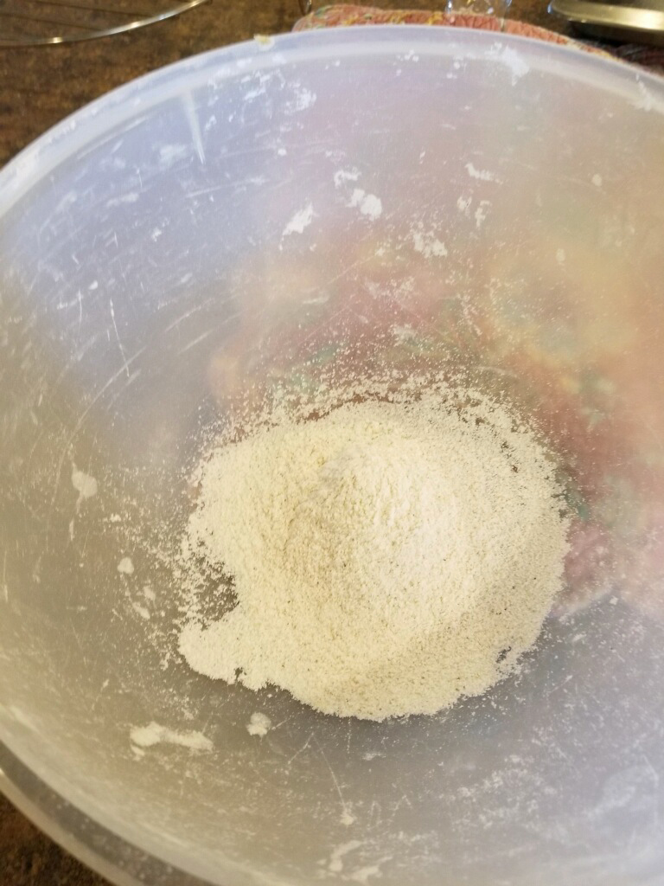
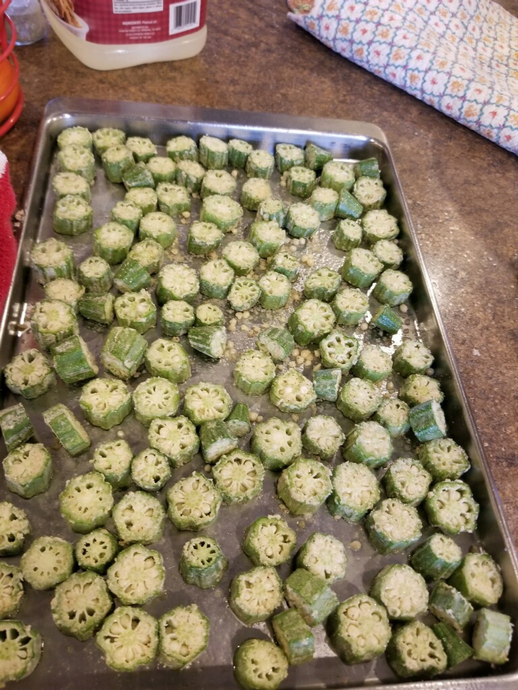
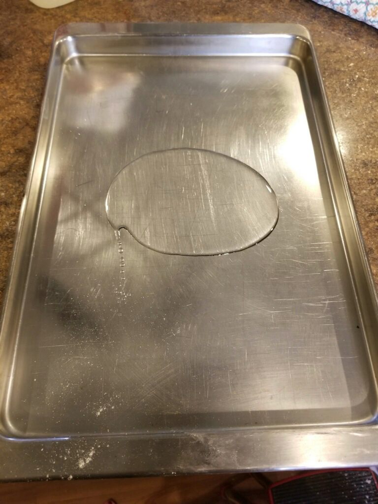
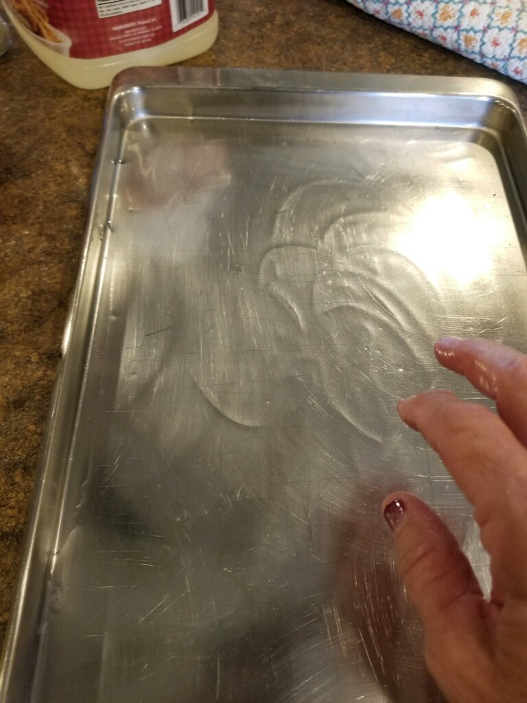
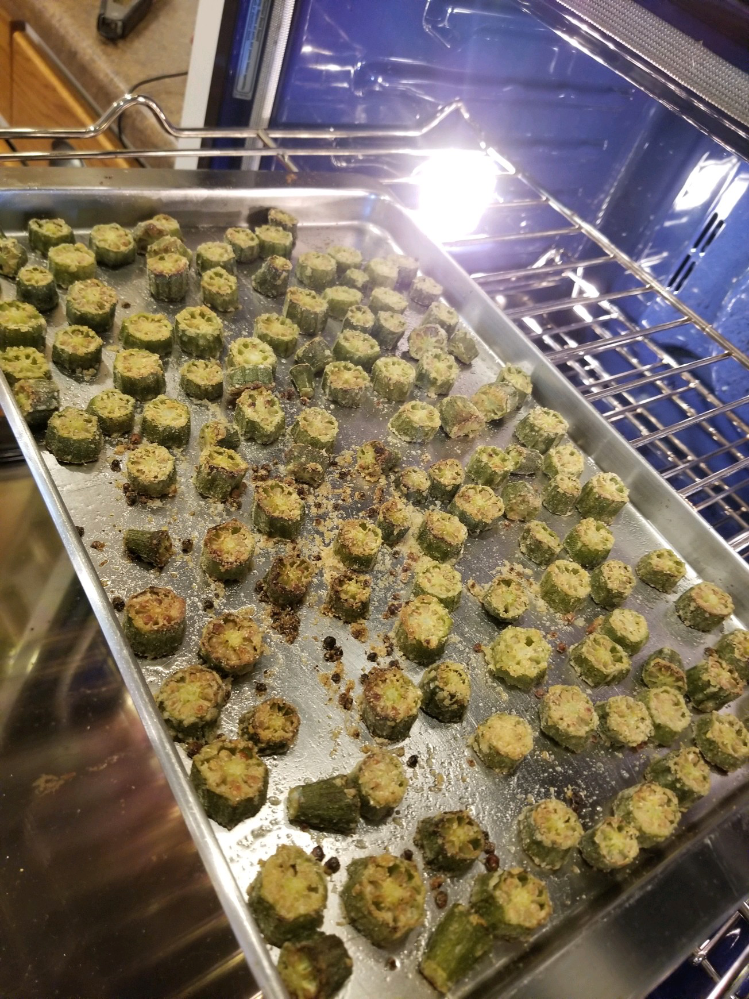
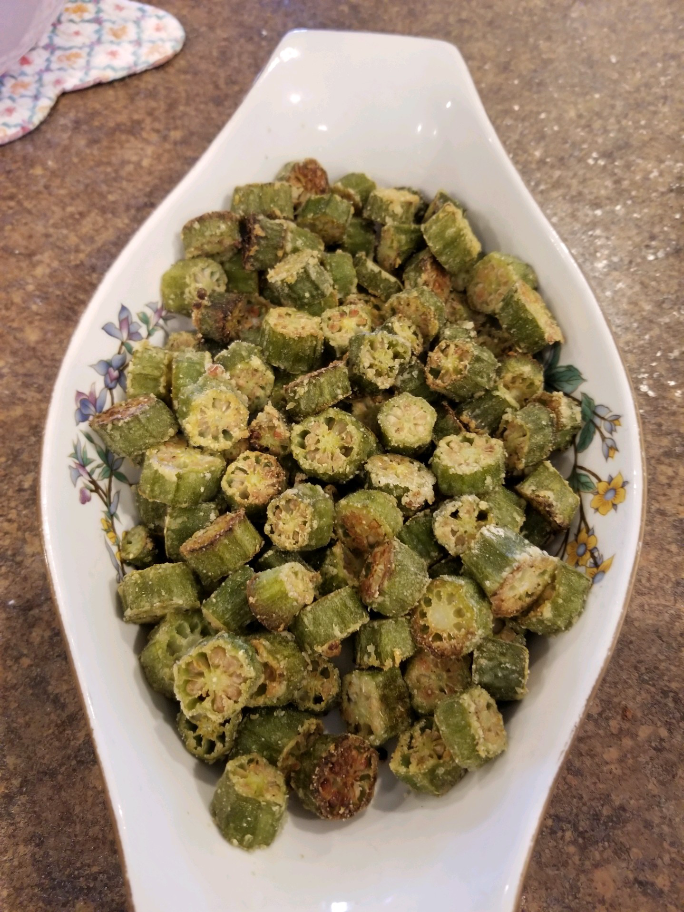
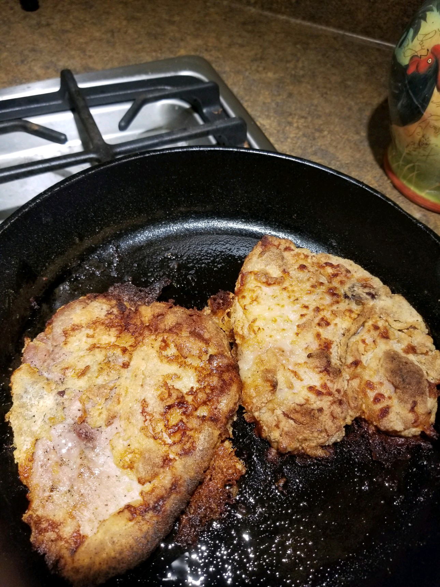
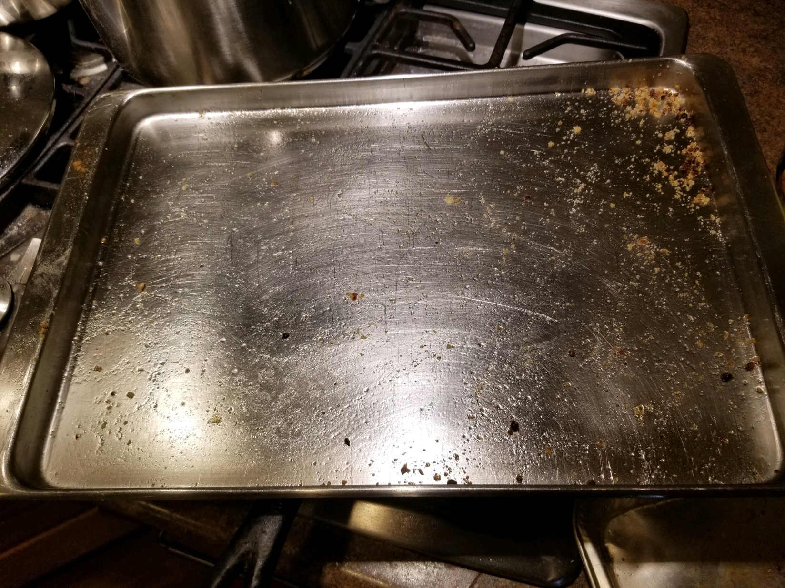

# Oven Fried Okra
by Debbie Kirkland on August 08, 2020

Heat over to 450.

Wash okra drain then slice. You don't want it real wet. Put about 1/4 cup Zartarans fish meal(gluten free) to about a pound of sliced okra. You don't want it heavily breaded. 

	
Shake in a covered bowl or bag. See, not much meal

Put just a little oil on your baking sheet and spread it around. 

Spread it around. 

Add the okra. Yout want it to breed no more than 1 layer weight plenty of room. This is about the most you want in the pan 

Spray well with cooking spray.  This step is VERY important.  I know you don't like Pam so use some oil in a spray bottle. If you don't do this,  it will not be nearly as good.  

Bake for 20 to 30 minutes until golden brown.  I will send a pic when mine gets done. 
    
I'll never fry okra again. 
    
Some recipes call for butter or I've even seen olive oil.   Butter burns too easily in a  450 oven and I'm pretty sure I've read too never fry in Olive oil. The heat does something to it. Peanut oil is best. 

	Tada!

I did the same thing with pork chops. They took 40 minutes. I flipped one over halfway through cooking. Ican't tell the difference so next time no flipping.
	Except the one I flipped lost some breading. Both cooked in the convection oven at the same time. 

I though it would be a major chore to clean the pan because of burned on oil, but not so with peanut oil because it had a high heat tolerance. 
Except I didn't use Zartarans on thre pork chops. They turned out real tender.
I think they would have been better with only 30 min.  I'l stop now.  Love you

